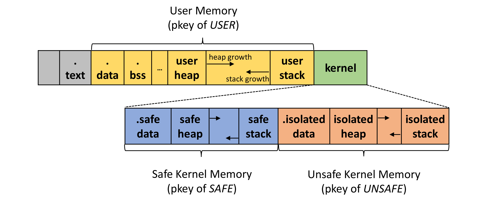
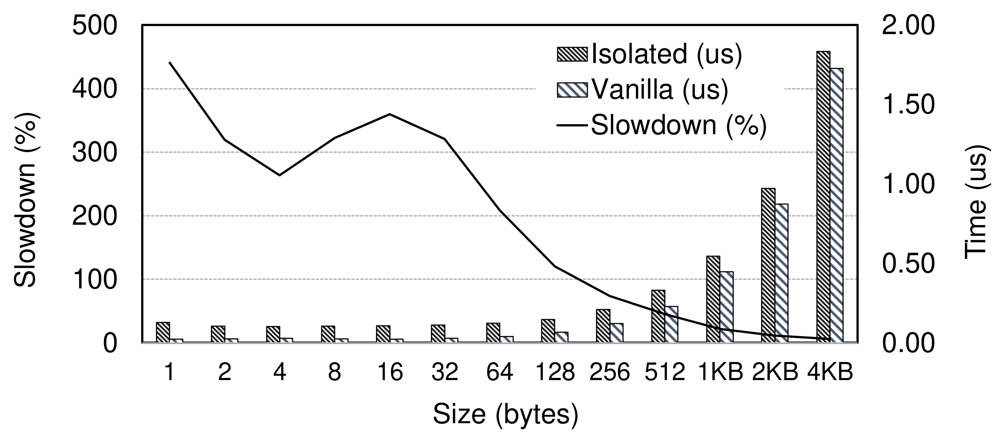
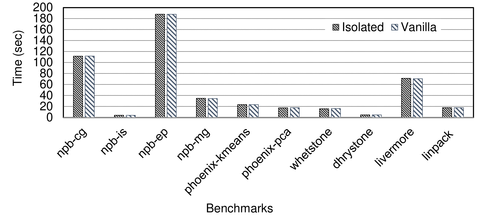

* * *
**News**
- libhermitMPK [paper](https://www.ssrg.ece.vt.edu/papers/vee20-mpk.pdf) is accepted at [VEE 2020](https://conf.researchr.org/home/vee-2020).

* * *

libhermitMPK is a new design bringing memory isolation inside a unikernel instance while keeping a *single address space*.
By leveraging Intel Memory Protection Keys (MPK), intra-unikernel isolation can be provided without impacting the lightweightness and performance benefits of unikernels.
libhermitMPK provides isolation between trusted and untrusted components: (1) safe from unsafe Rust kernel code and (2) kernel from user code.

  

libhermitMPK is implemented on top of [RustyHermit](https://github.com/hermitcore/libhermit-rs).

*For more details see our [VEE'20 paper](https://www.ssrg.ece.vt.edu/papers/vee20-mpk.pdf).*

### Trying it out
libhermitMPK is open source and all the code and instructions are on GitHub:
- [https://github.com/ssrg-vt/libhermitMPK](https://github.com/ssrg-vt/libhermitMPK)

### Design Principles
libhermitMPK follows the design objectives: (1) preservation of a single address space, (2) isolation of various memory areas, and (3) negligible cost. Below are evaluation results to demonstrate the design principles.

  

`write_bytes` is an unsafe kernel function writing byte to an arbitrary address. The isolated `write_bytes`
introduces a 6% slowdown compared to the vainila `write_bytes` when writing 4KB at a time.

  

The results of memory/compute intensive benchmarks from various suites including NPB, PARSEC, and Phoenix illustrate
that the average slowdown imposed by the intra-unikernel isolation compared with the vanilla unikernel is only 0.6%

For a detailed description please read libhermitMPK’s VEE 2020
[paper](https://www.ssrg.ece.vt.edu/papers/) at Virginia Tech.

### Contact
[Mincheol Sung](https://mincheolsung.com), Virginia Tech: mincheol *at* vt.edu

[Pierre Olivier](https://sites.google.com/view/pierreolivier), The University of Manchester: pierre.olivier *at* manchester.ac.uk

* * *

libhermitMPK is an open-source project of the [Systems Software Research Group](https://www.ssrg.ece.vt.edu/) at [Virginia Tech](https://vt.edu/). 

libhermitMPK is supported in part by the US Office of Naval Research under grants N00014-18-1-2022, N00014-16-1-2104, and N00014-16-1-2711. Any opinions, findings, and conclusions or recommendations expressed in this site are those of the author(s) and do not necessarily reflect the views of ONR.
